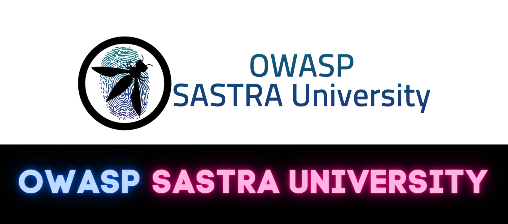

## WELCOME

OWASP SASTRA University was founded in Oct,2020. We organise Meetups, Webinar and Conferences. All these event are open, anyone who is interest can participate. We promote on Secure Application Development and share knowleadge on Cyber Security.
Join our mission to make Cyber Space a Better Place!

## Participation
The Open Web Application Security Project (OWASP) is a nonprofit foundation that works to improve the security of software. All of our projects ,tools, documents, forums, and chapters are free and open to anyone interested in improving application security. 

Chapters are led by local leaders in accordance with the [Chapter Leader Handbook](/www-policy/rules-of-procedure/chapter-handbook). Financial contributions should only be made online using the authorized online donation button.

Everyone is welcome and encouraged to participate in Our Events and Contribute your Support.

## For Events and Updates
Keep regularly checking our [Official OWASP SASTRA Meetup group](https://www.meetup.com/owasp-sastra-university-meetup-group/)



## Speakers
If you like to speak on our upcoming events, Kindly mail us
* [Abhisek R](mailto:abhisek.rajkumar@owasp.org)
* [Roopak Suresh](mailto:roopak.suresh@owasp.org)

**Email Format :**

- Speaker name
- Job Role
- Company / Organization
- Country.
- Email ID
- Contact Number
- Speaker Profile
- Presentation Details
    - Name / Title of the Presentation
    - Abstract of the presentation
    - Presentation time required

## Local News
- Introduction session on "Basics and Introduction to Cyber Security" by Abhisek R on 15/5/2021 at 06.30-07.30pm 
- Technical session on "Bug Bounties are more than hacking" by Wesley Thijs on 10/04/2021 at 12.30-01.30am 
- Interactive session on OSINT and Playing CTF By Roopak Suresh and Abhisek held on 14/02/2021 at 07.00-09.00pm  
- Session on Fundamentals of application security by Adithyan Ak (OWASP Coimbatore Lead) 
  on 08/11/2020 at 10.00-11.00am.
- Inaugration event of OWASP SASTRA University has been successfully completed on 18/11/2020 at 10.00-11.00am. 
  Guest: Dr. R. Kavitha, Sastra University, Network & Cyber security
